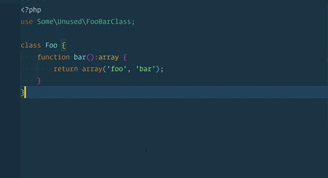

# PHP CS Fixer (php-cs-fixer)

This extension adds support for running `php-cs-fixer fix` on PHP files in Visual Studio Code. This extension supports `PHP8` syntax and `PSR12` style to fix PHP files.

## Getting Started

As long as PHP 8+ is installed on your system and in your PATH, the extension should work out of the box.

I have included `php-cs-fixer` from [here](https://github.com/FriendsOfPHP/PHP-CS-Fixer)

If you don't want to use the `php-cs-fixer` that's included with the extension, set the `php-cs-fixer.toolPath` setting to the path of `php-cs-fixer`.

## Extension Settings

This extension contributes the following settings:

* `php-cs-fixer.toolPath`: The path to the php-cs-fixer tool (default: "")
* `php-cs-fixer.useCache`: Use a cache file when fixing files (--using-cache) (default: false)
* `php-cs-fixer.allowRisky`: Determines whether risky rules are allowed (--allow-risky) (default: false)
* `php-cs-fixer.config`: Path to a .php_cs file (--config) (default: "")
* `php-cs-fixer.rules`: Rules to use when fixing files (--rules) (default: "@PSR1,@PSR2,@Symfony,-yoda_style")
* `php-cs-fixer.fixOnSave`: Runs fix command on save (default: true)

Credits: It is a forked version from an outdated extension [here](https://marketplace.visualstudio.com/items?itemName=fterrag.vscode-php-cs-fixer)