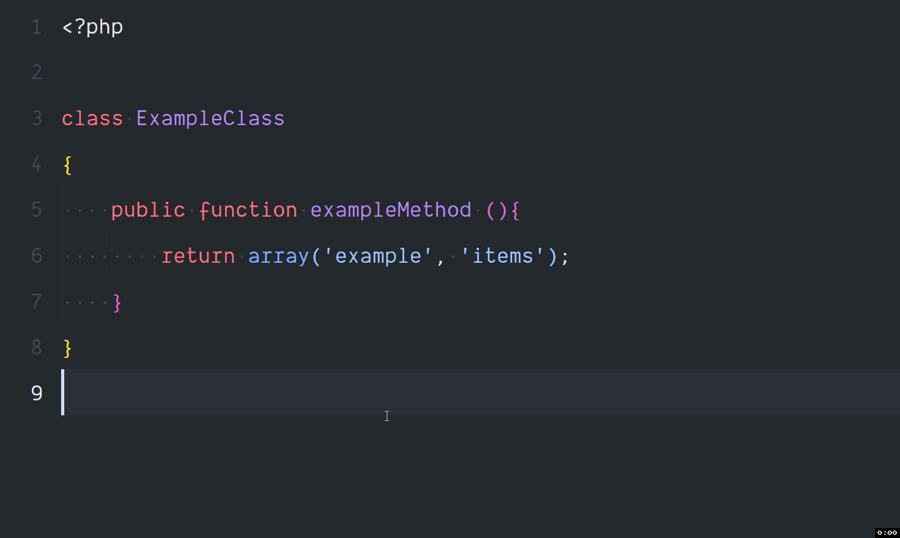

<div align="center">
    
</div>

<div align="center"><h1>PHP CS Fixer (Prettier for PHP)</h1></div>

This extension requires almost zero configuration to format `.php` files. It uses `v3.13.0` of [cs.symfony.com](https://cs.symfony.com/) by default but that's easily replaceable. As long as PHP 7+ is installed on your system and in your PATH, the extension should work out of the box.



## Extension Optional Settings

This extension contributes the following settings:

* `php-cs-fixer.toolPath`: The path to the php-cs-fixer tool (default: "")
* `php-cs-fixer.useCache`: Use a cache file when fixing files (--using-cache) (default: false)
* `php-cs-fixer.allowRisky`: Determines whether risky rules are allowed (--allow-risky) (default: false)
* `php-cs-fixer.config`: Path to a config file (--config) (default: "WorkspaceFolder/.php-cs-fixer.php" OR "WorkspaceFolder/php-cs-fixer.dist.php")
* `php-cs-fixer.rules`: Rules to use when fixing files (--rules) (default: "@PSR12,@PSR1,@PSR2,@Symfony,-yoda_style")
* `php-cs-fixer.fixOnSave`: Runs fix command on save (default: true)

### Need to use a custom `php-cs-fixer.phar` file?

[Download](https://cs.symfony.com/) the required file version from above link and provide the file path to the extension.

Open `settings.json` file (Ctrl + Shift + P) and add the following setting:

```json
"php-cs-fixer.toolPath": "path\\php-cs-fixer.phar",
```

On Windows:

```json
"php-cs-fixer.toolPath": "C:\\Users\\username\\.vscode\\php-cs-fixer.phar",
```

### Config File

This extension formats `.php` files based on specified rules. Commonly these rules are defined in a `php-cs-fixer.dist.php` OR `.php-cs-fixer.php` config file inside your project root path. The extension would try to pick a config file with above filenames, if not found it uses default rules.

You can also define a `global` config file which can be used accross all projects.

Open `settings.json` file (Ctrl + Shift + P) and add the following setting:

```json
"php-cs-fixer.config": "/full/config/file/path"
```

On Windows:

```json
"php-cs-fixer.config": "C:\\Users\\username\\.vscode\\.php-cs-fixer.php"
```

#### Not sure which rules to add?

Try out following config rules. Try to remove a rule and observe the changes.

```php
<?php

$config = new PhpCsFixer\Config();

return $config
    ->setRules([
        '@PSR12' => true,
        'new_with_braces' => false,
        'array_indentation' => true,
        'array_syntax' => ['syntax' => 'short'],
        'combine_consecutive_unsets' => true,
        'multiline_whitespace_before_semicolons' => true,
        'single_quote' => true,
        'blank_line_before_statement' => true,
        'braces' => [
            'allow_single_line_closure' => true,
        ],
        'concat_space' => ['spacing' => 'one'],
        'declare_equal_normalize' => true,
        'function_typehint_space' => true,
        'include' => true,
        'lowercase_cast' => true,
        'no_multiline_whitespace_around_double_arrow' => true,
        'no_spaces_around_offset' => true,
        'no_unused_imports' => true,
        'no_whitespace_before_comma_in_array' => true,
        'no_whitespace_in_blank_line' => true,
        'object_operator_without_whitespace' => true,
        'single_blank_line_before_namespace' => true,
        'ternary_operator_spaces' => true,
        'trailing_comma_in_multiline' => true,
        'trim_array_spaces' => true,
        'unary_operator_spaces' => true,
        'binary_operator_spaces' => true,
        'whitespace_after_comma_in_array' => true,
        'single_trait_insert_per_statement' => false,
    ])
    ->setLineEnding("\n");
```

You can find the complete rule set [here](https://github.com/FriendsOfPHP/PHP-CS-Fixer/blob/master/doc/ruleSets/index.rst)
